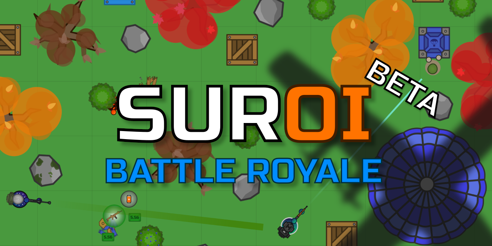

<div align="center">
  
  <hr>
</div>

<div align="center">
  
  
  
  
  
  
  <br>
  
  
  
</div>

## About
Suroi is an open-source 2D battle royale game inspired by [surviv.io](https://survivio.fandom.com/wiki/Surviv.io_Wiki). It is currently a work in progress.

## Play the game!
[suroi.io](https://suroi.io)

## Donate!
Any amount helps! All donation money goes towards the game directly.

[ko-fi.com/suroi](https://ko-fi.com/suroi)

## Join the Discord!
[discord.suroi.io](https://discord.suroi.io)

## Installation and setup
Start by installing [Git](https://git-scm.com/) and [Bun](https://bun.sh).

Use the following command to clone the repo:
```sh
git clone https://github.com/HasangerGames/suroi.git
```

Enter the newly created `suroi` directory with this command:
```sh
cd suroi
```

Finally, run this command in the `suroi` directory to install dependencies:
```sh
bun install
```

## Development
To start the game locally, run the following command in the project root:

```sh
bun dev
```
Or, to see output from the server and client separately, you can use the `bun dev:server` and `bun dev:client` commands. (Both must be running simultaneously for the game to work.)

To open the game, go to http://127.0.0.1:3000 in your browser.

## Production
To build the client for production, run this command in the project root:
```sh
bun build:client
```

To start the game server, run this command:
```sh
bun start
```

Production builds are served using [NGINX](https://nginx.org). Visit [the wiki](https://github.com/HasangerGames/suroi/wiki/Self%E2%80%90hosting) for details on how to self-host.
